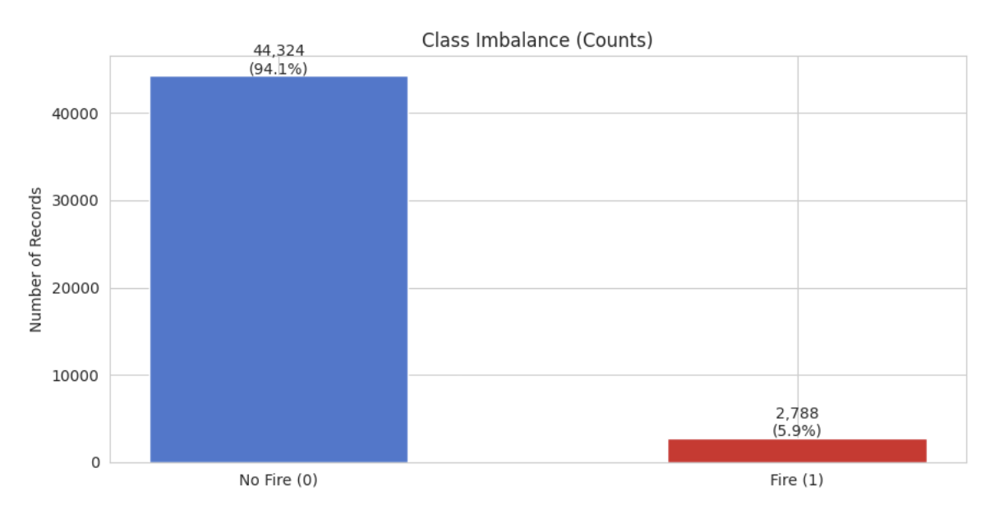
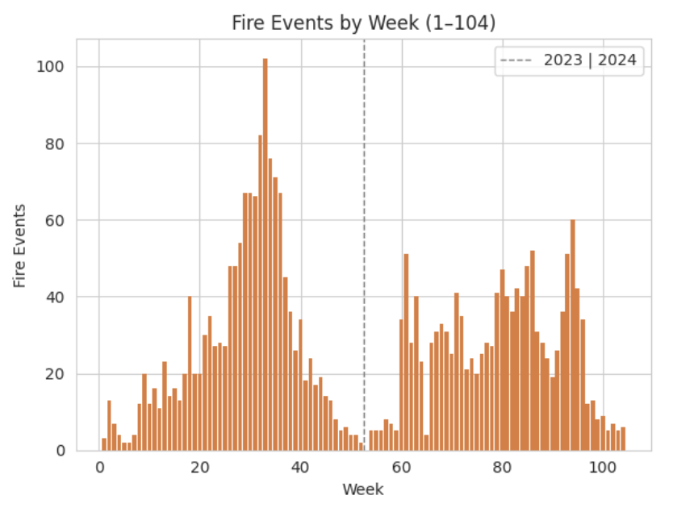

# County-Level Wildfire Prediction in the U.S. Using Multi-Source Data

Wildfires are both a driver and consequence of climate change. We built a machine learning pipeline to predict weekly county‑level wildfires across five U.S. states (2023‑2024) using temperature, precipitation, NDVI, and historical fire data. Five models were evaluated (logistic regression, XGBoost, LightGBM, GRU). Tree‑based ensembles (XGBoost/LightGBM) achieved the best balance between precision and recall under severe class imbalance, making them most suitable for real‑world fire prediction.

## Background
- Prior studies rely on noisy satellite fire data or only weather variables.
- Our work uses authoritative WFIGS fire perimeters and adds NDVI.
- Data from five states (CA, TX, MN, AZ, WA) captures diverse climate conditions.

## Methods

### Data Sources
- **Temperature & Precipitation:** weekly, county‑level (Google Earth Engine)
- **NDVI:** satellite‑derived vegetation index
- **Wildfire labels:** WFIGS fire perimeters → binary target (fire = 1 if ≥1 fire that week)

### Preprocessing & Feature Engineering
- Merged climate and fire CSVs; created lag features (t-3, t-2, t-1) for all variables.
- Added sine/cosine encoding of week to capture seasonality.
- Final dataset: 44,394 county‑week observations, 18 features.

### Train/Validation/Test Split
- **Train/Validation:** 2023 data (80/20 chronological split)
- **Test:** 2024 data (future, unseen)

### Models
- Naive Logistic Regression (baseline)
- Balanced Logistic Regression (class‑weighted)
- XGBoost & LightGBM (gradient‑boosted trees, imbalance‑aware)
- GRU (recurrent neural network for temporal sequences)

### Evaluation Metrics
- Recall, Accuracy, Precision, F1, ROC‑AUC, PR‑curve

## Results

| Model             | Accuracy | Precision | Recall | F1    |
|-------------------|----------|-----------|--------|-------|
| Naive LR          | 0.944    | 0.658     | 0.171  | 0.271 |
| Balanced LR       | 0.463    | 0.091     | 0.863  | 0.164 |
| XGBoost           | 0.533    | 0.096     | 0.793  | 0.172 |
| LightGBM          | 0.501    | 0.095     | 0.835  | 0.170 |
| GRU               | 0.347    | 0.079     | 0.911  | 0.146 |

**Key takeaways:**
- Naive LR is overly conservative (high precision, very low recall).
- GRU achieves highest recall but too many false alarms (low precision).
- **XGBoost and LightGBM offer the best balance**, which is practical for real‑world deployment.

## Discussion
- Imbalanced data remains the main challenge.
- Tree‑based models perform competitively with neural networks without overfitting.
- Limitations: only 5 states, limited features (no wind, human ignition data).
- Future work: add more features (wind, human factors), expand geographically, and collect multi‑year data.

## References
- Choi, Seungcheol, et al. “A Forest Fire Prediction Model Based on Meteorological Factors and the Multi-Model Ensemble Method.” Forests, vol. 15, no. 11, 2024, article 1981. MDPI, https://doi.org/10.3390/f15111981
- Di Giuseppe, Francesca, et al. “Global Data-Driven Prediction of Fire Activity.” Nature Communications, vol. 16, 2025, article 2918. Springer Nature, https://doi.org/10.1038/s41467-025-58097-7
- “WFIGS Current Interagency Fire Perimeters.” National Interagency Fire Center, ArcGIS Hub, https://data-nifc.opendata.arcgis.com/datasets/nifc::wfigs-current-interagency-fire-perimeters/ab out. Accessed 4 May 2026.
- Google. Google Earth Engine. https://earthengine.google.com/